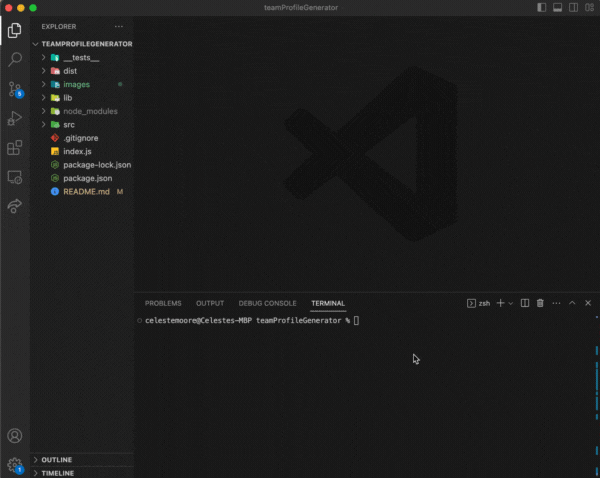

  

# teamProfileGenerator

### _A Node.js CLI that takes in information about employees on a software engineering team, then generates an HTML webpage that displays summaries for each person._

  

  
  ## Table of Contents
  
  - [Instructions](#Instructions)
  
  - [Media](#Media)
  
  - [Features](#Features)
  
  - [Contributors](#Contributors)
  
  - [Contact](#Contact)
  
  - [Project Status](#project-status)
  
  - [License](#License)

  ## Instructions

  *In order to install:*
  1. Clone this repository.
  2. Run **npm i** in the terminal.
  3. To run the test suites (using Jest), run **npm run test** in the terminal. See **__tests__** folder to customize tests.
  4. To start building your team, first delete the index.html file in the **dist** folder. 
  5. Run **node index.js** in the terminal, and follow the Inquirer prompts.
  6. Return to the dist folder, and open the new **index.html** file in the browser.
  7. You're all done!
  
  ## Media
   
    
   
  
  ## Features
  JavaScript, Node.js, Jest Unit Testing, Inquirer, Object-Oriented Programming (OOP)
  
  ## Contributors
  
  This website was created by Celeste Moore.
  
  ## Contact
  
  If you have any questions about this repository, contact celestealexmoore via GitHub or reach out via email:
  celestealexmoore@gmail.com.
  
  ## Project Status
  
  Completed
  
  ---
  
  ## License
  
  
  
  © 2023 _celestealexmoore_
